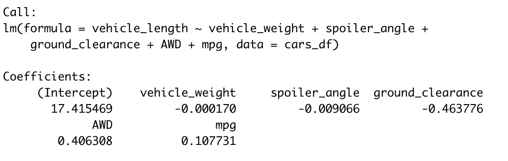
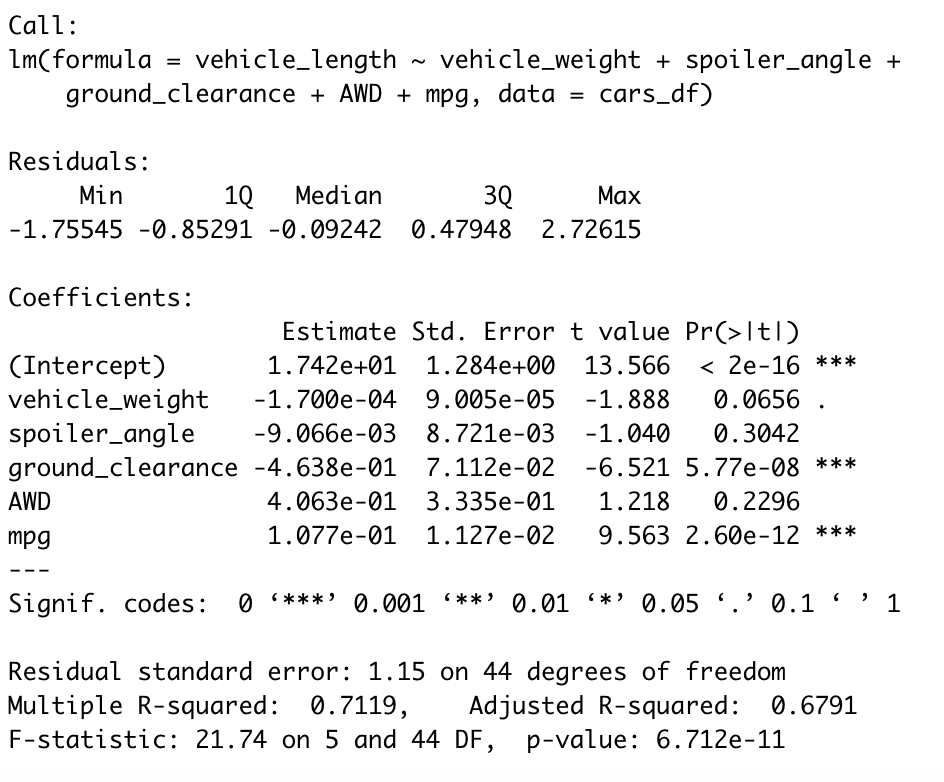

# MechaCar Statistical Analysis

## Linear Regression to Predict MPG
 

1. Which variables/coefficients provided a non-random amount of variance to the mpg values in the dataset?
- The variables that provided a non-random amount of vrianc

2. Is the slope of the linear model considered to be zero? Why or why not?
-

3. Does this linear model predict mpg of MechaCar prototypes effectively? Why or why not?
-

