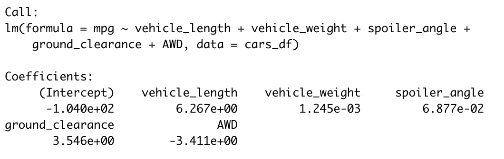
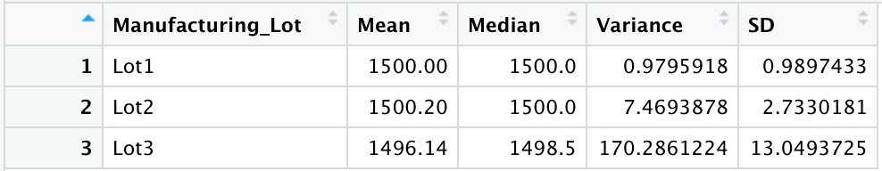

# MechaCar Statistical Analysis

## Linear Regression to Predict MPG
 

Which variables/coefficients provided a non-random amount of variance to the mpg values in the dataset?
- The variables that provided a non-random amount of variance are those with a p-value below the significance level of 0.05. Vehicle length and ground clearance are the only variables with a p-value low enough to conclude the correlation to mpg is not random.

Is the slope of the linear model considered to be zero? Why or why not?
- Because each variable has a different coefficient, we cannot assume one slope for the whole linear regression model. If we only use the significant variables, vehicle length and ground clearance, the slope would be somewhere between 3.546 and 6.267, so we can assume the slope of this linear regression would not be 0. However, taking all variables into account, one could argue that the slope is zero. My answer to this question would have to be inconclusive. 

Does this linear model predict mpg of MechaCar prototypes effectively? Why or why not?
- Because the overall p-value of the linear regression is extremely small, we can assume the linear model would effectively predict mpg of MechaCar prototypes. Additionally, an R-Squared value closer to 1 provides more evidence that the model is accurate.

## Summary Statistics on Suspension Coils

Does the current manufacturing data meet this design specification for all manufacturing lots in total and each lot individually? Why or why not?
- The data for Lot 1 has a variance of approximately 0.98, so it meets the design specification.
- The data for Lot 2 has a variance of approximately 7.47, so it meets the design specification as well.
- The data for Lot 3 has a variance of 170.29, so it does not meet the design specifications because the variance is higher than the threshold of 100. 
- In total, the data has an overall variance of 62.29, so it meets the design specification.
